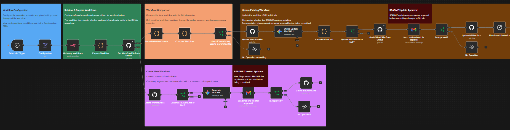
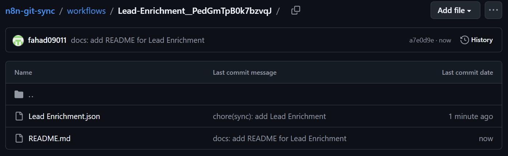
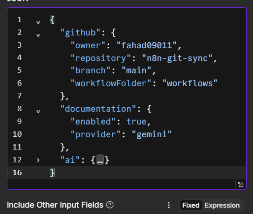

# GitSync for n8n

> Automated Git version control for n8n workflows with intelligent change detection and AI-assisted documentation.

GitSync for n8n is an open-source workflow that automatically synchronizes your n8n workflows to a GitHub repository.

Instead of manually exporting workflows or committing JSON files, GitSync continuously detects new and updated workflows, synchronizes them to GitHub, and optionally generates and maintains professional README documentation using AI.

To ensure documentation quality, all AI-generated README files and updates require manual approval before they are committed.#

---
<p align="center">
  
</p>

## Table of Contents

- Why GitSync?
- Features
- Architecture
- How It Works
- Repository Structure
- Installation
- Configuration
- Credentials
- Screenshots
- Roadmap
- Contributing
- License
# Why GitSync?

Version control is a fundamental part of modern software development, but managing n8n workflows in Git often requires manual exports, manual commits, and manual documentation.

As workflows evolve, keeping a Git repository up to date becomes repetitive and error-prone. Changes may go untracked, documentation can become outdated, and collaboration becomes more difficult.

GitSync for n8n automates this entire process by continuously synchronizing workflows to a GitHub repository. It detects newly created workflows, identifies meaningful changes to existing workflows, and updates the repository only when necessary to preserve a clean Git history.

For teams that maintain workflow documentation, GitSync can also generate and maintain professional README files using AI. Every AI-generated README creation or update requires manual approval before it is committed, giving you the benefits of automation without sacrificing documentation quality.

---

# ✨ Features

| Feature | Description |
|---------|-------------|
| 🔄 Automatic Workflow Synchronization | Keeps your GitHub repository synchronized with your n8n workflows on a scheduled basis. |
| 🆕 New Workflow Detection | Automatically detects newly created workflows and adds them to the repository. |
| ♻️ Intelligent Change Detection | Compares workflow definitions and commits only meaningful changes, avoiding unnecessary Git history noise. |
| 📁 Organized Repository Structure | Stores each workflow in its own dedicated folder with its workflow JSON and documentation. |
| 📄 AI-Generated Documentation | Automatically generates professional `README.md` documentation for newly synchronized workflows. |
| 🧠 Intelligent Documentation Updates | Evaluates whether workflow changes require documentation updates instead of regenerating README files unnecessarily. |
| 👤 Human Approval Workflow | Requires manual approval before creating or updating AI-generated documentation. |
| 📧 Email-Based Review Process | Sends proposed documentation changes by email, allowing reviewers to approve or reject them before publication. |
| 🐙 Native GitHub Integration | Uses the native n8n GitHub node to create and update workflow files directly in your repository. |
| ⚙️ Centralized Configuration | Repository settings, documentation options, and AI configuration are managed from a single configuration node. |
| ⏰ Scheduled Execution | Runs automatically on a configurable schedule without manual intervention. |
| 🚨 Error Workflow Support | Integrates with a dedicated error workflow to handle failures and operational alerts. |

---

# 🏗️ Architecture

GitSync continuously monitors your n8n instance, synchronizes workflow definitions to GitHub, and optionally maintains workflow documentation using AI with human approval.

```text
                        ┌─────────────────────┐
                        │  Schedule Trigger   │
                        └──────────┬──────────┘
                                   │
                                   ▼
                    ┌──────────────────────────┐
                    │ Retrieve n8n Workflows   │
                    └──────────┬───────────────┘
                               │
                               ▼
                    ┌──────────────────────────┐
                    │ Check GitHub Repository  │
                    └──────────┬───────────────┘
                               │
               ┌───────────────┴────────────────┐
               │                                │
               ▼                                ▼
      Workflow Exists                  New Workflow
               │                                │
               ▼                                ▼
     Compare Workflow                  Create Workflow File
               │                                │
         Changes Found?                Documentation Enabled?
          │          │                        │
          │ No       │ Yes                    ▼
          ▼          ▼               Generate README (AI)
        Finish   Update Workflow              │
                     │                        ▼
                     ▼               Manual Approval
           Evaluate README                 │
               Update?                     ▼
          │          │              Create README
          │ No       │ Yes
          ▼          ▼
       Finish   Generate Updated
                 README (AI)
                      │
                      ▼
              Manual Approval
                      │
                      ▼
               Update README
```

### Design Principles

- **Git-native** — Every synchronized workflow is stored in GitHub for version control and collaboration.
- **Change-aware** — Only meaningful workflow changes are committed, reducing unnecessary Git history.
- **Documentation-aware** — README files are generated or updated only when workflow behavior changes.
- **Human-in-the-loop** — AI-generated documentation is never published automatically; approval is required before committing changes.
- **Native n8n integrations** — Uses native n8n nodes wherever possible, minimizing custom code and simplifying maintenance.

---

# ⚙️ How It Works

Every time GitSync runs, it performs the following steps:

### 1. Retrieve Workflows

GitSync connects to your n8n instance and retrieves all available workflows.

---

### 2. Prepare for Synchronization

Each workflow is normalized and mapped to its corresponding location in the GitHub repository using a consistent folder and file structure.

---

### 3. Check GitHub

GitSync checks whether the workflow already exists in the configured GitHub repository.

- **If the workflow does not exist**, a new workflow file is created.
- **If the workflow already exists**, GitSync compares the current workflow with the version stored in GitHub.

---

### 4. Synchronize Workflow Changes

Only workflows with meaningful changes are committed.

This avoids unnecessary commits caused by metadata or other non-functional differences, helping keep the Git history clean and focused.

---

### 5. Manage Documentation (Optional)

If documentation is enabled:

- Newly synchronized workflows can have a professional `README.md` generated automatically.
- Existing documentation is updated only when workflow behavior changes.

Documentation is not regenerated for cosmetic or implementation-only changes.

---

### 6. Human Approval

Before any AI-generated documentation is committed:

- A review email containing the proposed documentation is sent.
- The reviewer can approve or reject the changes.
- Only approved documentation is committed to GitHub.

---

### 7. Complete Synchronization

After all workflows have been processed, GitSync finishes the synchronization cycle and waits for the next scheduled execution.

---

# 📁 Repository Structure

GitSync stores each workflow in its own dedicated directory. This keeps the workflow definition and its documentation together, making repositories easier to navigate, review, and maintain.

```
workflows/
│
├── MyWorkflow_1__A1B2C3D4/
│   ├── MyWorkflow_1.json
│   └── README.md
│
├── MyWorkflow_2__E5F6G7H8/
│   ├── MyWorkflow_2.json
│   └── README.md
│
├── MyWorkflow_3__I9J0K1L2/
│   ├── MyWorkflow_3.json
│   └── README.md
│
└── ...
```

## Directory Layout

Each workflow directory contains:

| File | Purpose |
|------|----------|
| `Workflow Name.json` | The exported n8n workflow definition synchronized from your n8n instance. |
| `README.md` | AI-generated documentation describing the workflow's purpose, integrations, inputs, outputs, and behavior. |

## Why This Structure?

Using one directory per workflow provides several benefits:

- 📂 Keeps workflow files and documentation together.
- 🔍 Makes workflows easier to locate in large repositories.
- 📖 Allows each workflow to have independent documentation.
- 📝 Produces cleaner pull requests by isolating changes to individual workflows.
- 🚀 Scales well as the number of workflows grows.
- `The workflow ID is appended to the directory name to ensure uniqueness. This prevents conflicts when multiple workflows share the same display name while maintaining stable paths across future synchronizations.`

---

# 🚀 Prerequisites & Installation

## Prerequisites

Before installing GitSync for n8n, ensure you have the following:

| Requirement | Description |
|------------|-------------|
| n8n | A self-hosted or cloud n8n instance with permission to access workflows. |
| GitHub Repository | A repository where workflow files and documentation will be synchronized. |
| GitHub OAuth Credential | Used to create and update files in the target repository. |
| n8n API Credential | Used to retrieve workflows from your n8n instance. |
| Google Gemini API Credential | Required for AI-generated workflow documentation. |
| Gmail OAuth Credential | Used to send documentation approval emails and wait for user approval. |

---

## Installation

### 1. Create a GitHub Repository

Create an empty GitHub repository that will store your synchronized workflows.

Example:

```
my-n8n-workflows
```

---

### 2. Import the Workflow

Import the `n8n-git-sync.json` workflow into your n8n instance.

---

### 3. Configure Credentials

Create and assign the required credentials:

- GitHub OAuth2
- n8n API
- Google Gemini API
- Gmail OAuth2

Verify that each node references the correct credential before enabling the workflow.

---

### 4. Configure the Workflow

Open the **Configuration** node and update the repository settings to match your environment.

Typical configuration includes:

- GitHub owner
- Repository name
- Branch
- Workflow directory
- Documentation settings

---

### 5. Configure the Schedule

Adjust the **Schedule Trigger** to control how frequently GitSync checks for workflow changes.

Choose an interval appropriate for your environment and expected workflow activity.

---

### 6. Enable the Workflow

Activate the workflow.

GitSync will begin monitoring your n8n instance and synchronizing workflows according to the configured schedule.

---

## First Synchronization

During the initial execution, GitSync will:

- Discover all available workflows.
- Create workflow directories in the GitHub repository.
- Upload each workflow definition.
- Generate README documentation (if enabled).
- Send approval requests before publishing AI-generated documentation.

Subsequent executions synchronize only new or modified workflows.

---

## Verification

After the first successful execution, your GitHub repository should contain:

```
workflows/
└── <Workflow Name>__<Workflow ID>/
    ├── Workflow Name.json
    └── README.md
```

If documentation generation is enabled, README files will only be created or updated after manual approval.

---

# ⚙️ Configuration

Most customization is performed through the **Configuration** node.

This centralizes repository settings, documentation behavior, and AI prompts, allowing the rest of the workflow to remain unchanged.

## GitHub Configuration

| Setting | Description | Default |
|---------|-------------|---------|
| `owner` | GitHub account or organization that owns the target repository. | `fahad09011` |
| `repository` | Repository where workflows will be synchronized. | `n8n-git-sync` |
| `branch` | Branch used for synchronization. | `main` |
| `workflowFolder` | Root directory where synchronized workflows are stored. | `workflows` |

> **Recommendation:** Update these values before running GitSync for the first time.

---

## Documentation Configuration

GitSync can automatically generate and maintain workflow documentation.

| Setting | Description | Default |
|---------|-------------|---------|
| `enabled` | Enables AI-generated README creation and maintenance. | `true` |
| `provider` | AI provider used for documentation generation. | `gemini` |
| `approval` | Controls how documentation changes are reviewed before publication. | `none`* |

> **Note:** Although the configuration currently specifies `none`, this workflow includes an email approval process before README files are created or updated.

---

## AI Prompt Configuration

The Configuration node also stores the prompts used for documentation generation.

This includes:

- System prompt
- User prompt
- Documentation template
- README generation instructions

Keeping prompts in a single location makes them easier to customize without modifying the workflow logic.

> **Advanced:** You can tailor the prompts to match your organization's documentation standards, formatting preferences, or writing style.

---

## Best Practices

For the best experience:

- Keep all repository settings in the Configuration node.
- Avoid hardcoding repository names in other nodes.
- Review AI prompts before making significant modifications.
- Test documentation generation in a development repository before using it in production.
- Commit Configuration changes before enabling scheduled synchronization.

---

# 🔐 Credentials

GitSync relies on native n8n credentials to securely communicate with external services.

Create the following credentials before enabling the workflow.

| Credential | Required | Purpose |
|------------|:--------:|---------|
| **n8n API** | ✅ | Retrieves workflows from your n8n instance. |
| **GitHub OAuth2** | ✅ | Creates and updates workflow files and documentation in the target GitHub repository. |
| **Google Gemini API** | ✅* | Generates and evaluates workflow documentation. |
| **Gmail OAuth2** | ✅* | Sends documentation approval requests and waits for approval before publishing README changes. |

> **\*** Required only when AI-generated documentation is enabled.

---

## Credential Permissions

To ensure GitSync functions correctly, each credential should have the appropriate permissions.

### GitHub OAuth2

The GitHub credential must have permission to:

- Read repository contents
- Create files
- Update existing files
- Commit changes

---

### n8n API

The n8n API credential must have permission to:

- Read workflows

No workflow modification permissions are required.

---

### Google Gemini API

The Gemini credential is used exclusively for:

- Generating README documentation
- Evaluating whether documentation should be updated

It is **not** used to modify workflow logic.

---

### Gmail OAuth2

The Gmail credential is responsible for:

- Sending documentation approval emails
- Waiting for reviewer approval or rejection
- Continuing the workflow based on the approval decision

No documentation is committed until approval is received.

---

## Optional Configuration

If AI-generated documentation is disabled:

- Google Gemini credentials are not required.
- Gmail credentials are not required.
- GitSync will continue synchronizing workflow JSON files without generating or updating README documentation.

---

## Security Recommendations

To help protect your environment:

- Store credentials using n8n's built-in credential manager.
- Use a dedicated GitHub account or organization for synchronization when possible.
- Grant only the minimum permissions required for each credential.
- Never hardcode API keys, access tokens, or passwords inside workflow nodes.
- Regularly review and rotate credentials according to your organization's security policies.

---

# 📸 Screenshots

The following screenshots provide a visual overview of GitSync and its key features.

## Workflow Overview

> Complete GitSync workflow showing synchronization, documentation generation, and approval process.


---

## Repository Structure

> Example GitHub repository after synchronization.


---

## AI Documentation Approval

> Example email requesting approval before creating or updating workflow documentation.


---

## Generated Workflow Documentation

> Example AI-generated README committed alongside a synchronized workflow.


---

## Workflow Directory

> Each synchronized workflow is stored in its own directory containing both the workflow definition and documentation.



---

## Configuration

> Repository settings, documentation options, and AI configuration are managed from a single Configuration node.




---

# 🤝 Contributing

Contributions of all sizes are welcome and appreciated.

Whether you've found a bug, have an idea for a new feature, want to improve the documentation, or would like to enhance the workflow, your contributions help make GitSync better for everyone.

## Ways to Contribute

You can contribute by:

- 🐛 Reporting bugs
- 💡 Suggesting new features
- 📖 Improving documentation
- ⚡ Optimizing workflow performance
- 🧪 Testing new releases
- 🔧 Fixing bugs
- ✨ Submitting pull requests

---

## Before Opening an Issue

Please check if a similar issue or feature request already exists.

When reporting a bug, include:

- n8n version
- Deployment type (Self-hosted / Cloud)
- Steps to reproduce
- Expected behavior
- Actual behavior
- Screenshots or logs (if applicable)

---

## Development Principles

GitSync follows a few simple design principles:

- Prefer native n8n nodes whenever possible.
- Keep workflows simple and easy to understand.
- Avoid unnecessary Code nodes.
- Build incrementally.
- Prioritize maintainability over complexity.
- Preserve backward compatibility whenever practical.
- Document new functionality.

These principles help keep the project approachable for both users and contributors.

---

## Pull Requests

When submitting a pull request:

- Keep changes focused on a single improvement.
- Update documentation when required.
- Test your changes before submitting.
- Follow the existing workflow structure and naming conventions.
- Explain the purpose of the change in the pull request description.

Constructive feedback and discussion are always welcome.

---

## Questions & Discussions

If you're unsure whether a feature fits the project, feel free to open a discussion or issue before starting implementation.

This helps ensure that new contributions align with the project's direction and avoids duplicated work.

---

# 📄 License

This project is licensed under the **MIT License**.

You are free to use, modify, distribute, and build upon this project in accordance with the terms of the license.

See the [LICENSE](LICENSE) file for full details.

---

# 🙏 Acknowledgements

GitSync for n8n builds upon the excellent ecosystem created by the following projects and communities:

- **n8n** – Workflow automation platform.
- **GitHub** – Version control and repository hosting.
- **Google Gemini** – AI-assisted workflow documentation.
- **The n8n Community** – For inspiration, feedback, and knowledge sharing.

A special thanks to everyone who contributes ideas, reports issues, and helps improve the project.

---

# ⭐ Support the Project

If GitSync helps you manage your n8n workflows, consider supporting the project by:

- ⭐ Starring the repository on GitHub
- 🐛 Reporting bugs and suggesting improvements
- 🤝 Contributing new features or documentation
- 💬 Sharing the project with the n8n community

Community feedback helps shape future releases and keeps the project improving.

---

# 📬 Feedback

Questions, ideas, and constructive feedback are always welcome.

If you encounter a problem or have a suggestion, please open an Issue or start a Discussion on GitHub.

---

<p align="center">
Made with ❤️ for the n8n community.
</p>
